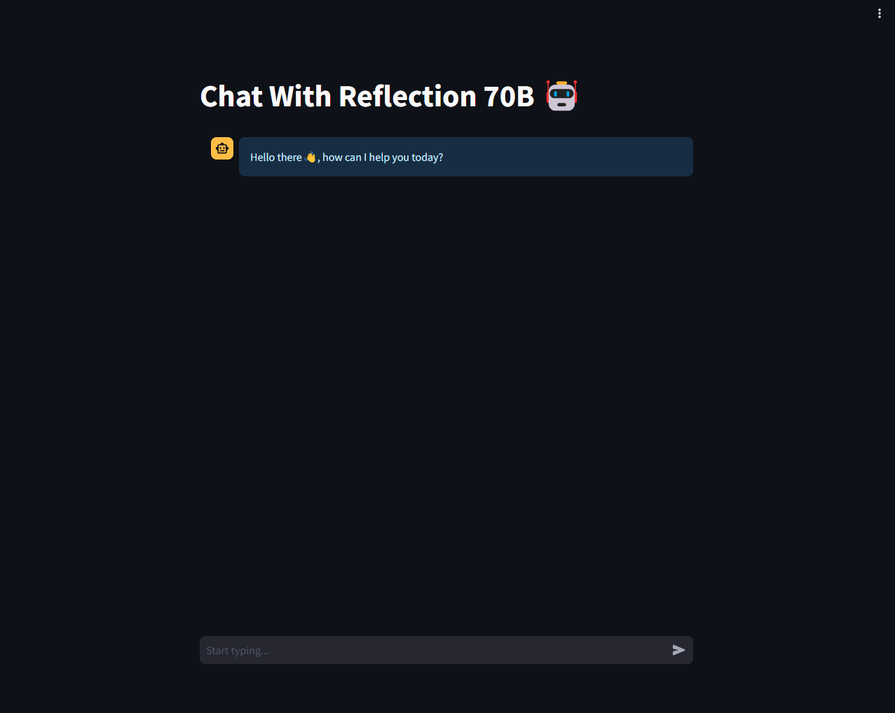

# Reflection 70B Chat

## Descriptio
- This GitHub repository integrates `Reflection Llama-3.1 70B`, the world's top open-source large language model (LLM), in a Streamlit-based user interface. The LLM is trained using a new technique called Reflection-Tuning, which enables it to detect and correct mistakes in its own reasoning.

## Libraries Used
 - requests
 - streamlit
 - langchain
 - python-dotenv
 - langchain_community

## File and Folder Explanation
1. `lib`: contains configuration and utility code files.
2. `images`: contains UI image.
3. `app.py`: main function that will run the Streamlit UI.
4. `lib/conifg.py`: contains functions to load our environment variables and get our api keys.
5. `lib/utils.py`: contains a function to setup our llm, accept user query and provide response.

## Installation
 1. Prerequisites
    - Git
    - Command line familiarity
 2. Clone the Repository: `git clone https://github.com/NebeyouMusie/Reflection-70B-Chat.git`
 3. Create and Activate Virtual Environment (Recommended)
    - `python -m venv venv`
    - `source venv/bin/activate` for Mac and `venv/bin/activate` for Windows
 4. Navigate to the projects directory `cd ./Reflection-70B-Chat` using your terminal
 5. Install Libraries: `pip install -r requirements.txt`
 6. Enter your `OPENROUTER_API_KEY` in the `example.env` file then change the file to `.env`. You can get your `OPENROUTER_API_KEY` from [here](https://openrouter.ai/settings/keys).
 7. run `streamlit run app.py`
 8. open the link that appears on your terminal in your preferred browser.

## Usage
 - Start by typing your question in the Chat Input located at the bottom of the app.
 - The LLM will provide a response, which will include the action it took to give the answer to the user along with the main response(`output`). 
 - Note that it won't remember previous user interactions (NO MEMORY) as that functionality has not been added.

## Collaboration
- Collaborations are welcomed ❤️

## Acknowledgments
 - I would like to thank [OpenRouter](https://openrouter.ai/)
   
## Contact
 - LinkedIn: [Nebeyou Musie](https://www.linkedin.com/in/nebeyou-musie)
 - Gmail: nebeyoumusie@gmail.com
 - Telegram: [Nebeyou Musie](https://t.me/NebeyouMusie)
